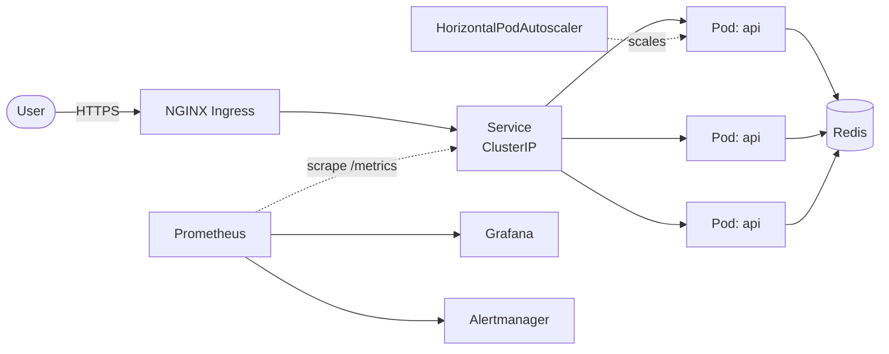
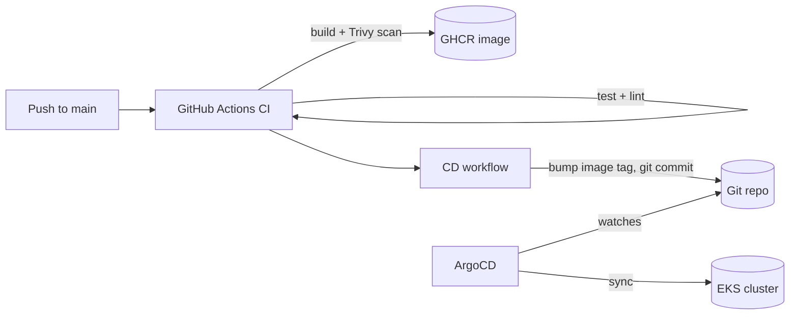

# Architecture

## System overview

## Request flow

1. **Create** — `POST /api/shorten` validates the URL, generates a
   cryptographically-random 7-char code (retrying on collision), writes
   `url:<code> -> long_url` to Redis, returns the short URL.
2. **Redirect** — `GET /{code}` looks the code up in Redis and issues a
   `307` redirect. Unknown codes return `404`.

Redis is the single source of truth and the cache simultaneously — O(1)
lookups, and it's the natural place to later add click counters, rate limits,
and TTL-based expiry (already wired via `LINK_TTL_SECONDS`).

## Platform / delivery flow

## Design decisions & trade-offs

| Decision | Why | Trade-off |
| --- | --- | --- |
| FastAPI + Redis | Async, auto OpenAPI, O(1) KV fits the access pattern | Single Redis is a SPOF; prod would use replication/ElastiCache |
| GitOps via ArgoCD | Declarative, auditable, instant `git revert` rollback | Extra moving part vs. `kubectl apply` from CI |
| Helm (not raw YAML/Kustomize) | Values-driven multi-env, dependency mgmt, ecosystem | Templating can get gnarly at scale |
| Single NAT gateway | Cost control for a portfolio | Not AZ-fault-tolerant; one-per-AZ for real prod |
| Trivy report-only | Visibility without blocking early | Should gate merges once baseline is clean |
| 307 redirect | Preserves method, non-cacheable, keeps control | Slightly slower than a cached 301 |

## Reliability features

- **Probes:** separate liveness / readiness / startup probes.
- **HPA:** 3→20 replicas on CPU/memory.
- **PodDisruptionBudget:** keeps ≥2 pods during voluntary disruptions.
- **Topology spread:** replicas spread across nodes.
- **Multi-AZ** VPC + node group.

## Scaling path (what I'd do next)

- Redis → ElastiCache (cluster mode) or a sharded KV for write scale.
- Add a CDN / edge cache for hot redirects (301 with short TTL).
- Async click analytics via a stream (Kinesis/Kafka) instead of inline counters.
- Snowflake-style ID generation to drop the collision-retry loop entirely.
